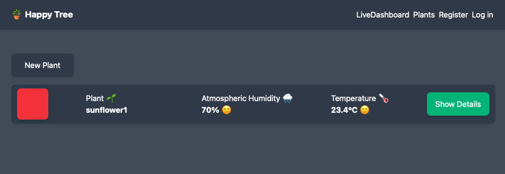

# happyTree

## Requirements

- ESP 32
- Grovekit
- Elixir
- Platformio
- Docker
- AWS Account
- Trefle API key

## Installation

- Clone this repository
- Setup the phoenix app `happy_tree/README.md`
- Setup the ESP32 `esp32/README.md`
