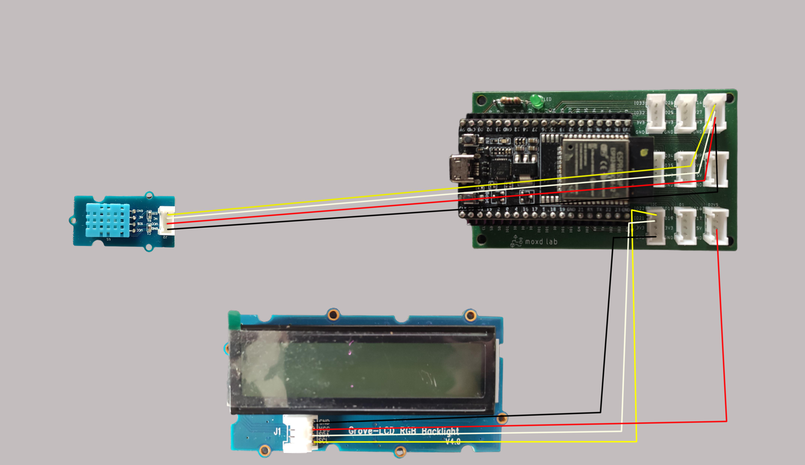

# ESP32 AWS IoT (How to connect ESP32 to AWS IoT Core)

## Anschlüsse



## Code

Bevor wir den ESP32 Code auf unseren ESP32 laden müssen wir folgende Konfiguration an unser Gerät anpassen.

In der `aws.h` Datei finden wir folgende Konfiguration:

```cpp
#define AWS_END_POINT "broker.mqttdashboard.com"
#define AWS_PORT 1883

#define DEVICE_NAME "sunflower1"

#define PUBLISH_DATA_TOPIC "plants/sunflower1/data"
#define ATMOSPHERIC_HUMIDITY_OUT_OF_RANGE "plants/sunflower1/atmospheric_humidity_out_of_range"
#define ATMOSPHERIC_HUMIDITY_IN_RANGE "plants/sunflower1/atmospheric_humidity_in_range"
```

Wir können `sunflower1` überall mit unserem eigentlichen Gerätenamen, welchen wir in der Webapp finden ersetzen.

In der `main.cpp` Datei müssen wir noch zustätzlich unsere WiFi SSID und das WiFi Passwort ändern.

```cpp
const char *SSID = "abcd";
const char *PWD = "abcd"
```

Wenn alles richtig angeschlossen wurde, werden die Sensordaten erfolgreich an unsere Webapp gesandt, und wir erhalten den aktuellen Status der Pflanze um die Statusanzeige des LED Bildschirms zu aktualisieren.

Der Callback sieht wie folgt aus:

```cpp
void callback(char *topic, byte *payload, unsigned int length)
{
  Serial.println(topic);

  if (strcmp(topic, ATMOSPHERIC_HUMIDITY_OUT_OF_RANGE) == 0)
  {
    lcd.clear();
    lcd.setCursor(0, 0);
    lcd.print(":(");
    lcd.setCursor(0, 1);
    lcd.print("Bitte giessen");
    lcd.setRGB(255, 0, 0);
  }

  if (strcmp(topic, ATMOSPHERIC_HUMIDITY_IN_RANGE) == 0)
  {
    lcd.clear();
    lcd.setCursor(0, 0);
    lcd.print(":)");
    lcd.setCursor(0, 1);
    lcd.print("Pflanze gluecklich");
    lcd.setRGB(127, 255, 0);
  }
}
```
